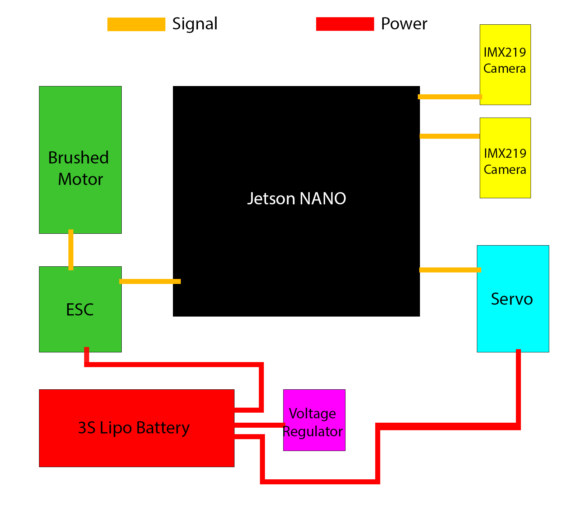

***

**Official GitHub repository for WRO Future Engineers team GIGABIT SPACE 2023. All code, documentation, and files are located here.**

***

# Contents
* [Hardware](#hardware-documentation)
    * [Assembly Instructions & Diagrams](#assembly)
    * [Photos](#photos)
* [Uploading Programs](#uploading-programs)
* [Software](#software-documentation)
    * [Operating System](#operating-system)
    * [Programming Language](#programming-language)
    * [Code Documentation](#code-documentation)
* [Team Photos!!](#team-photos)
* [Demonstrations](#demonstration-video)
* [LiPo Battery Safety Notice](#lipo-battery-safety-notice)

***

# HARDWARE

## ASSEMBLY

Shortened assembly instructions:
1. Print 3D models
2. Assemble rear axle
3. Solder electronics
4. Assemble steering mechanism
5. Attach main platform
6. Attach electronics
7. Attach upper platform

#### **For an actual build guide, go to [Assembly.md](./Assembly.md)**

Here is a simple schematic for how the electronics are wired:

## Photos
|                                |                                  |
| ------------------------------ | -------------------------------- |
|  |      |
|    |    |
|      |  |

***

# Uploading Programs

Make sure you have gone through the [Jetson Nano setup](./ASSEMBLY.md#jetson-nano-setup) steps and set your static IP, have some form of sshfs, and created the program directory. To upload the program, simply copy the contents of the "Program" into the remote directory. **Do not delete the previous directory; you will have to re-install packages!**

***

# Software Documentation

## Operating System

We used the Jetson Nano's existing operating system, which is Ubuntu 18.04 with Jetpack. It has been changed to text-only mode to remove the unnecessary GUI. We also added a startup script ([see "Board Setup" in ASSEMBLY.md](./ASSEMBLY.md#board-setup-sshfs-and-static-ip)) to run the program on startup, which waits for a button press before running the program.

***

## Programming Language

All our code is in python (except the GIGABIT SPACE Control Panel and GIGABIT SPACE Randomizer, those are HTML/JS/CSS applications used for development).

Dependencies:
* Jetson-GPIO
* jetcam
* numpy
* cv2
* adafruit-servokit
* adafruit-circuitpython-mpu6050
* python-socketio
* math
* asyncio
* typing
* traceback
* os
* base64
* time
* threading

The **entire** `Program` directory must be uploaded in order for the program to run. Ensure the `path` constant in `startup.py` is defined properly.

Example:
    `/home/mihir/Desktop/wro-repo-colab/Code_Main/Program/`

***

# Team Photos

***

## Code Documentation

See [DOCS.md](./DOCS.md).

***

# LiPo Battery Safety Notice

While LiPo batteries are the safest form of portable, affordable, high density energy storage, there are still precautions to be taken when working with them. Lithium is a highly volatile element, and will react with the water vapor in the air if exposed to it.

1. **Do not** puncture, deform, short, or heat LiPo batteries above 26° C (80° F)
2. Store and charge LiPos in a *fireproof container* **away** from flammable materials and water
3. **NEVER** charge a swollen or damaged battery (e.g. damaged leads, swelling of cells, puncture in wrapping)
4. **NEVER** leave a charging battery unattended
5. Only charge LiPo batteries with chargers *designed for LiPo batteries*
6. Dropping a battery can cause sufficient damage to rupture a cell and cause shorts
7. Overdischarging a LiPo battery can cause **permanent damage**

If a LiPo battery goes below its minimum voltage (stated in the manual included or 3.3v multiplied by the amount of cells connected in series) it can cause **permanent internal damage**. This damage is not visible until after further use, when it can swell, or potentially burst and **cause a FIRE**.

**Read all safety notes and instructions included with LiPo batteries before use.**

### For a more detailed LiPo safety manual there is one on [HobbyKing](https://hobbyking.com/en_us/blog/lipo-battery-safety-101-a-guide)
